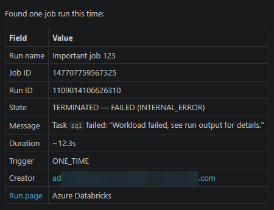
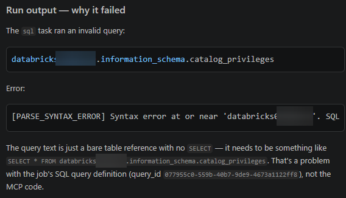
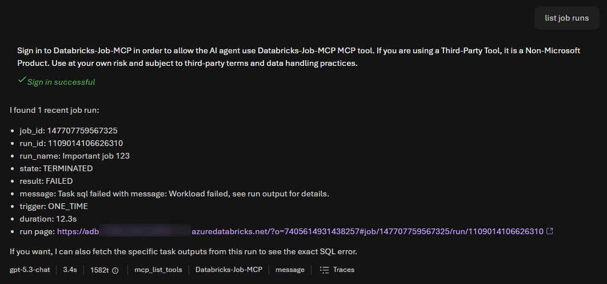

# Azure Databricks Jobs MCP Server

> [!CAUTION]
> This is a **sample implementation** provided for educational
> purposes. It is not intended for production use without proper security review, testing, and hardening. Use at your own risk.

A Python [MCP](https://modelcontextprotocol.io) server that exposes a **limited**
set of Azure Databricks **Jobs** capabilities. It authenticates callers with
**Microsoft Entra ID** and uses the **On-Behalf-Of (OBO)** flow so that, when used
from **GitHub Copilot in VS Code** (or any other client), every Databricks call is made **as the
signed-in user** (their Databricks permissions apply).

Built with [FastMCP](https://gofastmcp.com) and managed with [uv](https://docs.astral.sh/uv/).

## Tools

| Tool | Databricks endpoint | Description |
|------|---------------------|-------------|
| `list_jobs` | `GET /api/2.2/jobs/list` | List jobs (helps discover job IDs). |
| `list_runs` | `GET /api/2.2/jobs/runs/list` | List job runs, filter by job / state. |
| `get_run` | `GET /api/2.2/jobs/runs/get` | Get details/status of a run. |
| `get_run_output` | `GET /api/2.2/jobs/runs/get-output` | Get a task run's output. |
| `run_now` | `POST /api/2.2/jobs/run-now` | Trigger a new run of a job. |

Only these jobs-related tools are exposed — no other Databricks capabilities.

## How authentication works

This server is an **OAuth 2.0 protected resource** ([RFC 9728](https://www.rfc-editor.org/rfc/rfc9728)).
It does not run any login UI of its own — it validates the bearer tokens it receives
and tells clients which authorization server (Entra) issues them.

```
VS Code Copilot  --OAuth-->  Microsoft Entra ID  --token-->  Copilot  --Bearer-->  MCP server  --OBO-->  Databricks
  (user signs in directly)   (issues access token)                   (validates JWT)      (acts as user)
```

1. Copilot reads this server's **Protected Resource Metadata** at
   `/.well-known/oauth-protected-resource/mcp` (RFC 9728 §3.1 appends the `/mcp`
   resource path after `/.well-known/oauth-protected-resource`), which names Entra
   as the authorization server and the scope to request.
2. Copilot performs the OAuth flow **directly with Entra** and receives an access token
   with **audience = this app's API** (`api://<client_id>`).
3. Copilot calls the MCP endpoint with that token. The server validates the JWT locally
   against Entra's published JWKS (signature, issuer, audience, and required scope).
4. Each tool takes the validated inbound token and runs the **OBO exchange** (MSAL) for
   scope `2ff814a6-3304-4ab8-85cb-cd0e6f879c1d/.default` (the Azure Databricks resource).
5. The resulting token is used as `Authorization: Bearer` against the Jobs API.

### Server credential: client secret or managed identity

Token *validation* (step 3) needs no secret — the server only fetches Entra's public
JWKS. The **On-Behalf-Of exchange** (step 4) is where the server acts as a
**confidential client** and must prove the app's identity. There are two ways to do that:

- **Client secret** — set `AZURE_CLIENT_SECRET`. Simplest for local
  development.
- **Managed identity** (recommended on Azure) — set `AZURE_USE_MANAGED_IDENTITY=true`.
  The app authenticates with a **federated identity credential**: a managed identity
  mints a short‑lived assertion for the `api://AzureADTokenExchange` audience, which
  Entra trusts in place of a secret. No secret is stored or rotated. See
  [Deploying to Azure Container Apps](#deploying-to-azure-container-apps).

> **Why both an app registration and a managed identity?**
> The managed identity replaces the **client secret**, not the app registration —
> they do different jobs:
> - The **app registration** exposes the API/scopes and holds the delegated
>   **`user_impersonation`** permission that makes the OBO ("act as the user")
>   exchange possible. Managed identities can do none of these — they only get tokens
>   *for themselves* (app-only), never *on behalf of a user*.
> - The **managed identity** is just a secretless way to prove the app registration's
>   identity during the OBO exchange (via the federated credential).
>
> So you can drop the secret, but not the app registration — unless you give up
> per-user access and call Databricks as a single shared service principal instead.

## Prerequisites

- Python 3.12+ and [uv](https://docs.astral.sh/uv/)
- An Azure Databricks workspace, and a user with access to it
- An Entra app registration (see below)

## Entra app registration requirements

> This server assumes the app registration already exists. Configure it as follows.

1. **Expose an API**
   - Application ID URI: keep the default `api://<client_id>`.
   - Add a scope, e.g. `jobs` (matches `MCP_REQUIRED_SCOPES`).
2. **Certificates & secrets** → create a **client secret** (store it in `.env`),
   or use a **managed identity** when deployed (see below). This credential is used
   only for the OBO exchange.
3. **API permissions** → add **AzureDatabricks → `user_impersonation`** (Delegated),
   then **Grant admin consent**. This permission lets the OBO exchange succeed.

### Client access to the API

Because clients authenticate **directly with Entra** (which has no Dynamic Client
Registration), the MCP client needs to be a client Entra recognizes and must be
allowed to request the `api://<client_id>/jobs` scope. In VS Code, Copilot performs
the Entra sign-in when you first use a tool and requests the scope advertised in the
Protected Resource Metadata. Ensure user (or admin) consent is granted for the client
to access this API's `jobs` scope in your tenant.

## Setup

```bash
# 1. Install dependencies
uv sync

# 2. Create your local config
cp .env.example .env      # then fill in the values

# 3. Run the server (Streamable HTTP)
uv run databricks-jobs-mcp
```

The server listens on `http://127.0.0.1:8000/mcp` by default.

### Configuration (`.env`)

| Variable | Required | Description |
|----------|----------|-------------|
| `AZURE_TENANT_ID` | yes | Entra tenant (directory) ID. |
| `AZURE_CLIENT_ID` | yes | App registration (client) ID. |
| `AZURE_CLIENT_SECRET` | conditional | App registration client secret. Required unless `AZURE_USE_MANAGED_IDENTITY=true`. |
| `AZURE_USE_MANAGED_IDENTITY` | no (`false`) | Authenticate the OBO exchange with a managed identity federated credential instead of a secret. |
| `AZURE_MANAGED_IDENTITY_CLIENT_ID` | no | Client ID of the user-assigned managed identity. Omit for the system-assigned identity. |
| `MCP_BASE_URL` | no (`http://localhost:8000`) | Public base URL; published as the resource identifier in Protected Resource Metadata. On Azure Container Apps it is auto-derived by combining the injected `CONTAINER_APP_NAME` and `CONTAINER_APP_ENV_DNS_SUFFIX` when left unset. |
| `MCP_HOST` | no (`127.0.0.1`) | Bind interface. |
| `MCP_PORT` | no (`8000`) | Bind port. |
| `MCP_REQUIRED_SCOPES` | no (`jobs`) | Exposed API scope name(s), comma separated. |
| `DATABRICKS_HOST` | yes | Workspace URL, e.g. `https://adb-xxxx.azuredatabricks.net`. |
| `DATABRICKS_API_VERSION` | no (`2.2`) | Jobs API version (use `2.1` only if needed). |
| `LOG_LEVEL` | no (`INFO`) | Logging verbosity (`DEBUG`, `INFO`, `WARNING`, `ERROR`). Set to `DEBUG` to log the exact reason a token is rejected (issuer/audience/scope mismatch, signature/JWKS failures). |

Secrets live **only** in `.env` (gitignored).

## Using from VS Code Copilot

A repo-level [`.mcp.json`](.mcp.json) is included:

```json
{
  "mcpServers": {
    "databricks-jobs": { "type": "http", "url": "http://localhost:8000/mcp" }
  }
}
```

Start the server (`uv run databricks-jobs-mcp`), then open the repo in VS Code with
Copilot. On first use of a tool, Copilot opens the Entra sign-in flow; afterwards the
jobs tools are available and run as you.

## Container image

A [`Dockerfile`](Dockerfile) is included. It builds a slim, multi-stage image with
[uv](https://docs.astral.sh/uv/), runs as a non-root user, and binds the HTTP
transport to `0.0.0.0:8000` (via `MCP_HOST` / `MCP_PORT`) so it works behind an
ingress.

```bash
# Build
docker build -t databricks-jobs-mcp:latest .

# Run locally (the container listens on 8000)
docker run --rm -p 8000:8000 --env-file .env databricks-jobs-mcp:latest
```

## Deploying to Azure Container Apps

> Requires the [Azure CLI](https://learn.microsoft.com/cli/azure/) with the
> `containerapp` extension and Docker. Replace the placeholder values below.

The app authenticates to Entra with a **managed identity** — no client secret is
stored or rotated. It uses a **federated identity credential (FIC)**: a user-assigned
managed identity mints a short-lived assertion that Entra trusts in place of a secret.

```bash
# 0. Variables
RG=rg-databricks-mcp
LOCATION=swedencentral
ACR=acrdatabricksmcp...           # must be globally unique
ENV=cae-databricks-mcp
APP=databricks-jobs-mcp
UAMI=id-databricks-mcp
CLIENT_ID=<client-id>            # App REGISTRATION client ID (= AZURE_CLIENT_ID), NOT the managed identity
TENANT_ID=<tenant-id>            # Entra tenant (directory) ID

# 1. Resource group + container registry
az group create -n $RG -l $LOCATION
az acr create -n $ACR -g $RG --sku Basic

# 2. Build & push the image (uses the included Dockerfile)
az acr build -r $ACR -t $APP:latest .

# 3. Container Apps environment
az containerapp env create -n $ENV -g $RG -l $LOCATION

# 4. Create a user-assigned managed identity and read its IDs
az identity create -n $UAMI -g $RG -l $LOCATION
MI_CLIENT_ID=$(az identity show -n $UAMI -g $RG --query clientId -o tsv)
MI_PRINCIPAL_ID=$(az identity show -n $UAMI -g $RG --query principalId -o tsv)
MI_RESOURCE_ID=$(az identity show -n $UAMI -g $RG --query id -o tsv)

# Let the managed identity pull images from the registry (no ACR admin user)
az role assignment create \
  --assignee-object-id $MI_PRINCIPAL_ID --assignee-principal-type ServicePrincipal \
  --role AcrPull \
  --scope $(az acr show -n $ACR -g $RG --query id -o tsv)

# 5. Configure the app registration to trust the managed identity (FIC).
#    --id is the app REGISTRATION (= AZURE_CLIENT_ID); the subject is the
#    managed identity's principal ID, and the audience is fixed.
az ad app federated-credential create \
  --id $CLIENT_ID \
  --parameters '{
    "name": "databricks-mcp-mi",
    "issuer": "https://login.microsoftonline.com/'$TENANT_ID'/v2.0",
    "subject": "'$MI_PRINCIPAL_ID'",
    "audiences": ["api://AzureADTokenExchange"]
  }'

# 6. Deploy the app with the managed identity assigned (no client secret)
az containerapp create \
  -n $APP -g $RG --environment $ENV \
  --image $ACR.azurecr.io/$APP:latest \
  --registry-server $ACR.azurecr.io \
  --registry-identity $MI_RESOURCE_ID \
  --target-port 8000 --ingress external \
  --min-replicas 1 \
  --user-assigned $MI_RESOURCE_ID \
  --env-vars \
    AZURE_TENANT_ID=$TENANT_ID \
    AZURE_CLIENT_ID=$CLIENT_ID \
    AZURE_USE_MANAGED_IDENTITY=true \
    AZURE_MANAGED_IDENTITY_CLIENT_ID=$MI_CLIENT_ID \
    DATABRICKS_HOST=https://adb-xxxx.azuredatabricks.net

# 7. Fetch the app's FQDN
az containerapp show -n $APP -g $RG --query properties.configuration.ingress.fqdn -o tsv
```

The same, in PowerShell:

```powershell
# 0. Variables
$RG        = "rg-databricks-mcp"
$LOCATION  = "swedencentral"
$ACR       = "acrdatabricksmcp..."          # must be globally unique
$ENVNAME   = "cae-databricks-mcp"
$APP       = "databricks-jobs-mcp"
$UAMI      = "id-databricks-mcp"
$TENANT_ID = "<tenant-id>"   # Entra tenant (directory) ID
$CLIENT_ID = "<client-id>"   # App REGISTRATION client ID (= AZURE_CLIENT_ID), NOT the managed identity

# 1. Resource group + container registry
az group create -n $RG -l $LOCATION
az acr create -n $ACR -g $RG --sku Basic

# 2. Build & push the image (uses the included Dockerfile)
az acr build -r $ACR -t "$($APP):latest" .

# 3. Container Apps environment
az containerapp env create -n $ENVNAME -g $RG -l $LOCATION

# 4. Create a user-assigned managed identity and read its IDs
az identity create -n $UAMI -g $RG -l $LOCATION
$MI_CLIENT_ID    = az identity show -n $UAMI -g $RG --query clientId -o tsv
$MI_PRINCIPAL_ID = az identity show -n $UAMI -g $RG --query principalId -o tsv
$MI_RESOURCE_ID  = az identity show -n $UAMI -g $RG --query id -o tsv
$ACR_ID          = az acr show -n $ACR -g $RG --query id -o tsv

# Let the managed identity pull images from the registry (no ACR admin user)
az role assignment create `
  --assignee-object-id $MI_PRINCIPAL_ID --assignee-principal-type ServicePrincipal `
  --role AcrPull `
  --scope $ACR_ID

# 5. Configure the app registration to trust the managed identity (FIC).
#    The audience is fixed; the subject is the managed identity's principal ID.
@{
  name      = "databricks-mcp-mi"
  issuer    = "https://login.microsoftonline.com/$TENANT_ID/v2.0"
  subject   = $MI_PRINCIPAL_ID
  audiences = @("api://AzureADTokenExchange")
} | ConvertTo-Json | Set-Content -Path fic.json -Encoding utf8
az ad app federated-credential create --id $CLIENT_ID --parameters '@fic.json'

# 6. Deploy the app with the managed identity assigned (no client secret)
az containerapp create `
  -n $APP -g $RG --environment $ENVNAME `
  --image "$($ACR).azurecr.io/$($APP):latest" `
  --registry-server "$($ACR).azurecr.io" `
  --registry-identity $MI_RESOURCE_ID `
  --target-port 8000 --ingress external `
  --min-replicas 1 `
  --user-assigned $MI_RESOURCE_ID `
  --env-vars `
    AZURE_TENANT_ID=$TENANT_ID `
    AZURE_CLIENT_ID=$CLIENT_ID `
    AZURE_USE_MANAGED_IDENTITY=true `
    AZURE_MANAGED_IDENTITY_CLIENT_ID=$MI_CLIENT_ID `
    DATABRICKS_HOST=https://adb-xxxx.azuredatabricks.net

# 7. Fetch the app's FQDN
az containerapp show -n $APP -g $RG --query properties.configuration.ingress.fqdn -o tsv
```

The app's public FQDN is shown after `containerapp create` (or via
`az containerapp show -n $APP -g $RG --query properties.configuration.ingress.fqdn -o tsv`).

After deploying:
- `MCP_BASE_URL` is **auto-derived** from the stable Container Apps FQDN
  (`CONTAINER_APP_NAME` + `CONTAINER_APP_ENV_DNS_SUFFIX`),
  so you don't need to set it. (To override the URL, e.g. a custom domain, set
  `MCP_BASE_URL` explicitly.)
- **No `AZURE_CLIENT_SECRET` is needed.** The OBO exchange uses the FIC instead.
- `AZURE_MANAGED_IDENTITY_CLIENT_ID` selects the user-assigned identity. Omit it only
  if you use the Container App's system-assigned identity (and set the FIC subject to that
  identity's principal ID instead).
- Token validation is **stateless**, so the app scales to multiple replicas without
  extra configuration.
- The app registration still needs the **AzureDatabricks → `user_impersonation`**
  permission, which powers the OBO exchange.
- `https://databricks-jobs-mcp.abcdef123456.swedencentral.azurecontainerapps.io/.well-known/oauth-protected-resource/mcp`
  is the Protected Resource Metadata endpoint (RFC 9728). Copilot uses it
  to learn this server's resource identifier, the authorization server (Entra) to obtain
  tokens from, and the scope to request.

Here is an example of the metadata document returned by the deployed server:

```json
{
  "resource": "https://databricks-jobs-mcp.abcdef123456.swedencentral.azurecontainerapps.io/mcp",
  "authorization_servers": [
    "https://login.microsoftonline.com/<tenant-id>/v2.0"
  ],
  "scopes_supported": [
    "api://<client-id>/jobs"
  ],
  "bearer_methods_supported": [
    "header"
  ],
  "resource_name": "Azure Databricks Jobs"
}
```

To use that in Copilot, you can use the following `.mcp.json`:

```json
{
  "mcpServers": {
    "databricks-jobs-azure": {
      "type": "http",
      "url": "https://databricks-jobs-mcp.abcdef123456.swedencentral.azurecontainerapps.io/mcp"
    }
  }
}
```


## Notes

- Inspired by the (stdio-based) [databricks-solutions/ai-dev-kit](https://github.com/databricks-solutions/ai-dev-kit);
  this server is intentionally HTTP + OBO and jobs-only.

## Troubleshooting authentication (401 `invalid_token`)

A `401 Unauthorized` with `{"error": "invalid_token"}` means the server rejected the
bearer token during JWT validation (signature, issuer, audience or required scope) —
it never reached a tool, so the OBO exchange is not involved yet. By default the logs
only show the generic `Auth error returned: invalid_token`. Set **`LOG_LEVEL=DEBUG`**
to make FastMCP's `JWTVerifier` log the precise reason:

- **Issuer / audience / scope mismatch** is logged at `WARNING`, e.g.
  `Bearer token rejected ... audience mismatch (got ..., expected ...)`.
- **Signature / JWKS / format** failures are logged at `DEBUG`, e.g.
  `Token validation failed: JWT signature/format invalid`.

When a token is rejected, the server also logs (at `DEBUG`) a decoded — but
**unverified** — summary of the offending token so you can see the actual claims
without capturing the bearer token by hand:

```text
Rejected bearer token: header={alg=..., kid=..., typ=..., nonce=...} \
  claims={iss=..., aud=..., appid/azp=..., ver=..., scp=..., exp=...}
```

The server also logs (at `DEBUG`) the exact values it validates against at startup:

```text
Auth config: base_url=... issuer=... audiences=[...] required_scopes=[...] jwks_uri=...
```

> **`JWT signature/format invalid` with a successful JWKS fetch?** The token reached
> signature verification but failed. The `Rejected bearer token:` line tells you why:
> - **`nonce=PRESENT`** → the client obtained a **nonce-protected** Microsoft token
>   (issued when the token's `aud` is a Microsoft first-party resource, not this API).
>   These are intentionally **not** validatable by third parties. The client must
>   request a token for **this** API (`api://<client_id>/jobs`), as advertised in the
>   Protected Resource Metadata — not for Microsoft Graph or another resource.
> - **`not a well-formed JWS`** → the client sent an opaque/garbled token, not a JWT.

Enable it on the deployed Container App (this restarts the revision):

```bash
az containerapp update -n $APP -g $RG --set-env-vars LOG_LEVEL=DEBUG
# then stream the logs and reproduce from Foundry
az containerapp logs show -n $APP -g $RG --follow
```

Common causes when calling from **Microsoft Foundry**:

- **Audience mismatch** — Foundry obtained a token whose `aud` is not this app
  (`api://<client_id>` / `<client_id>`). The metadata at
  `/.well-known/oauth-protected-resource/mcp` must advertise this server's resource and
  the `api://<client_id>/jobs` scope so the client requests a token for *this* API.
- **Issuer mismatch** — the token must be a **v2.0** token
  (`https://login.microsoftonline.com/<tenant-id>/v2.0`).
- **Missing scope** — the token lacks the required `jobs` scope (`MCP_REQUIRED_SCOPES`).
- **Wrong base URL** — if `MCP_BASE_URL` does not match the public FQDN, clients may
  request a token for the wrong resource. On Container Apps it is auto-derived; override
  only for custom domains.

Turn it back off once diagnosed:

```bash
az containerapp update -n $APP -g $RG --set-env-vars LOG_LEVEL=INFO
```

## Example responses

Copilot summarizing a failed job run (`list_runs` / `get_run`):



Copilot explaining why the run failed (`get_run_output`):



Foundry showing the job run output in a notebook (`get_run_output`):


