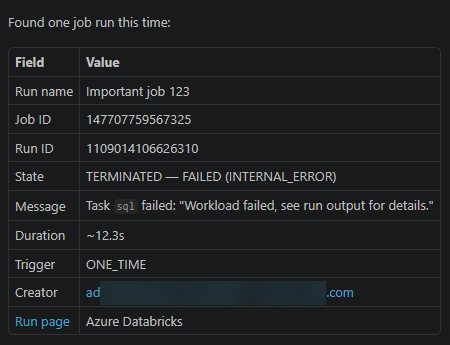
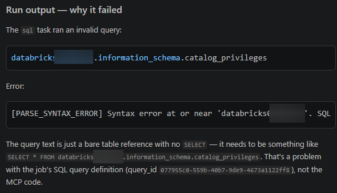
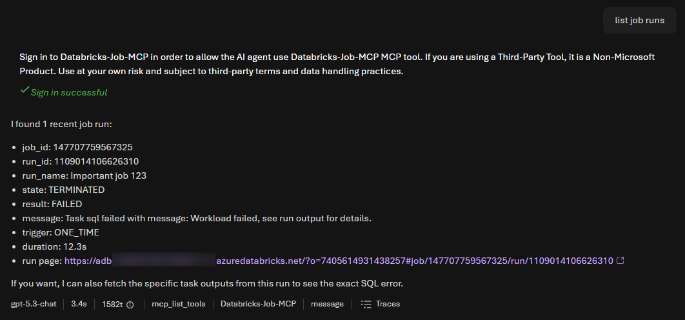

# Azure Databricks Jobs MCP Server

> [!CAUTION]
> This is a **sample implementation** provided for educational
> purposes. It is not intended for production use without proper security review, testing, and hardening. Use at your own risk.

A Python [MCP](https://modelcontextprotocol.io) server that exposes a **limited**
set of Azure Databricks **Jobs** capabilities. It authenticates callers with
**Microsoft Entra ID** and supports two authentication paths:

- **Users**, including **GitHub Copilot in VS Code**, call Databricks **as the
  signed-in user** through the **On-Behalf-Of (OBO)** flow. Their Databricks
  permissions apply.
- **Machines** (service principals or managed identities) call without an
  interactive user. The server uses **client credentials** to call Databricks
  **as the MCP server's app-registration service principal**.

This enables unattended clients to inspect job status, retrieve outputs, and
optionally trigger runs. Scheduling, polling, and analysis remain the client's
responsibility.

Built with [FastMCP](https://gofastmcp.com) and managed with [uv](https://docs.astral.sh/uv/).

## Tools

| Tool | Databricks endpoint | Description | Required machine app role |
|------|---------------------|-------------|---------------------------|
| `list_jobs` | `GET /api/2.2/jobs/list` | List jobs (helps discover job IDs). | `Jobs.Read` |
| `list_runs` | `GET /api/2.2/jobs/runs/list` | List job runs, filter by job / state. | `Jobs.Read` |
| `get_run` | `GET /api/2.2/jobs/runs/get` | Get details/status of a run. | `Jobs.Read` |
| `get_run_output` | `GET /api/2.2/jobs/runs/get-output` | Get a task run's output. | `Jobs.Read` |
| `run_now` | `POST /api/2.2/jobs/run-now` | Trigger a new run of a job. | `Jobs.Run` |

Only these jobs-related tools are exposed — no other Databricks capabilities.
The role names above are defaults and can be configured. `Jobs.Run` alone permits
`run_now`; it does not grant read access. Assign both roles when a machine must
trigger runs and inspect their results. Delegated users do not need these app
roles; their required API scopes and Databricks permissions apply instead.

## How authentication works

This server is an **OAuth 2.0 protected resource** ([RFC 9728](https://www.rfc-editor.org/rfc/rfc9728)).
It does not run any login UI of its own — it validates the bearer tokens it receives
and tells clients which authorization server (Entra) issues them.

### Delegated users (OBO)

```
VS Code Copilot  --OAuth-->  Microsoft Entra ID  --token-->  Copilot  --Bearer-->  MCP server  --OBO-->  Databricks
  (user signs in directly)   (issues access token)                   (validates JWT)      (acts as user)
```

1. Copilot reads this server's **Protected Resource Metadata** at
   `/.well-known/oauth-protected-resource/mcp` (RFC 9728 §3.1 appends the `/mcp`
   resource path after `/.well-known/oauth-protected-resource`), which names Entra
   as the authorization server and the scope to request.
2. Copilot performs the OAuth flow **directly with Entra** and receives an access token
   with **audience = this app's API** (`api://<client_id>`).
3. Copilot calls the MCP endpoint with that token. The server validates the JWT locally
   against Entra's published JWKS (signature, issuer, audience, and required scope).
4. Each tool takes the validated inbound token and runs the **OBO exchange** (MSAL) for
   scope `2ff814a6-3304-4ab8-85cb-cd0e6f879c1d/.default` (the Azure Databricks resource).
5. The resulting token is used as `Authorization: Bearer` against the Jobs API.

### Machines (app-only)

```text
SP / managed identity --Entra token for MCP API--> MCP server
  MCP server --client credentials--> Entra --Databricks token--> Jobs API
                                                     (acts as MCP server SP)
```

1. The caller obtains an app-only token for **this MCP API**, with assigned app
   roles in the `roles` claim, and sends it as a bearer token to `/mcp`.
2. The server validates the JWT against Entra's JWKS, issuer, and accepted
   audiences (`api://<client_id>` or `<client_id>`). Its central gate accepts
   tokens carrying **all** configured delegated scopes or **at least one**
   recognized app role. Tokens satisfying neither condition are rejected.
3. A caller is treated as a machine when `idtyp` is `app`, or when it has roles
   but no delegated `scp`/`scope`. Each tool checks its specific machine role
   before acquiring a Databricks token or calling the Jobs API.
4. For an authorized machine caller, MSAL acquires a Databricks token through
   client credentials using the **server's** app registration and existing
   credential. MSAL caches the token internally. App-only tokens never use OBO,
   and the inbound token is never forwarded to Databricks.

There is **no feature flag** for machine access and no role is assigned by default.
Control access through app-role assignments and the server principal's Databricks
permissions.

> **Shared Databricks identity:** all machine callers act as the MCP server's
> app-registration service principal, not as the calling SP or managed identity.
> Databricks audit logs therefore attribute these requests to the MCP server SP.
> Grant that principal only the job permissions it needs. Per-machine-caller
> Databricks identities are not supported.

### Server credential: client secret or managed identity

Token *validation* needs no secret — the server only fetches Entra's public
JWKS. In this implementation, both the **On-Behalf-Of exchange** and
**client-credentials token acquisition** use the app registration as a
**confidential client**, so the server must prove that app's identity.
There are two ways to do that:

- **Client secret** — set `AZURE_CLIENT_SECRET`. Simplest for local
  development.
- **Managed identity** (recommended on Azure) — set `AZURE_USE_MANAGED_IDENTITY=true`.
  The app authenticates with a **federated identity credential**: a managed identity
  mints a short‑lived assertion for the `api://AzureADTokenExchange` audience, which
  Entra trusts in place of a secret. No secret is stored or rotated. See
  [Deploying to Azure Container Apps](#deploying-to-azure-container-apps).

> **Why both an app registration and a managed identity?**
> In this implementation, the managed identity replaces the **client secret**,
> not the app registration — they do different jobs:
> - The **app registration** exposes the API/scopes and machine app roles, and
>   holds the delegated **`user_impersonation`** permission that makes the OBO ("act as the user")
>   exchange possible. It also identifies the shared SP used for machine calls to
>   Databricks. Managed identities cannot expose this API or perform OBO themselves.
> - The **managed identity** is used as a secretless way to prove the app registration's
>   identity during either outbound flow (via the federated credential).
>
> So you can drop the secret, but not the app registration in this implementation.
> A machine caller's managed identity is separate from the identity used to
> authenticate the server's outbound token requests.

### Alternative: calling Databricks directly with managed identity

Azure Databricks also supports **direct managed-identity authentication**. For a
machine-only outbound request, the server could obtain a Databricks-audience token
using its own managed identity and call the Jobs API as that identity. This
connection does **not** require a separate app registration, client secret, or
federated identity credential.

The managed identity must be assigned to the Databricks workspace and granted
the required job permissions. A managed identity is backed by an Entra service
principal, and Databricks treats it as a service principal; no **separate**
app-registration service principal is needed for this outbound connection. See
[Authenticate with Azure managed identities](https://learn.microsoft.com/en-us/azure/databricks/dev-tools/auth/azure-mi).

| Outbound machine flow | Identity Databricks sees | Federated identity credential |
|-----------------------|-------------------------|-------------------------------|
| Current managed-identity mode: identity authenticates the app registration | MCP app-registration SP | Required |
| Alternative: identity obtains a Databricks token directly | Server's managed identity | Not required |

These outbound choices are separate from **caller-to-MCP authentication**. This
server's app registration also exposes the MCP API's scopes and app roles and
identifies its accepted token audience. It supports the delegated user/OBO path
as well. Using direct managed identity for machine calls would not remove those
inbound API and OBO requirements.

**Direct managed identity for Databricks is not currently implemented here.**
`AZURE_USE_MANAGED_IDENTITY=true` selects federated authentication of the app
registration, not direct Databricks access. Adopting the alternative would require
changing the outbound machine token acquisition and granting Databricks permissions
to the managed identity instead of relying on the app-registration SP's grants.
It would still use one shared outbound identity for all machine callers, not
preserve each calling machine's identity.

## Prerequisites

- Python 3.12+ and [uv](https://docs.astral.sh/uv/)
- An Azure Databricks workspace, with access granted to users for OBO and/or the
  MCP server's app-registration service principal for machine calls
- An Entra app registration (see below)

## Entra app registration requirements

> This server assumes the app registration already exists. Configure it as follows.

1. **Expose an API**
   - Application ID URI: keep the default `api://<client_id>`.
   - Add a scope, e.g. `jobs` (matches `MCP_REQUIRED_SCOPES`).
2. **Certificates & secrets** → create a **client secret** (store it in `.env`),
   or use a **managed identity** when deployed (see below). Both outbound
   authentication paths reuse this credential.
3. For delegated user access, **API permissions** → add **AzureDatabricks → `user_impersonation`** (Delegated),
   then **Grant admin consent**. This permission lets the OBO exchange succeed.

### Delegated client access to the API

Because clients authenticate **directly with Entra** (which has no Dynamic Client
Registration), the MCP client needs to be a client Entra recognizes and must be
allowed to request the `api://<client_id>/jobs` scope. In VS Code, Copilot performs
the Entra sign-in when you first use a tool and requests the scope advertised in the
Protected Resource Metadata. Ensure user (or admin) consent is granted for the client
to access this API's `jobs` scope in your tenant.

### Machine client access to the API

1. On the **MCP server's app registration**, create enabled **App roles** with
   **Allowed member types = Applications** (`allowedMemberTypes: ["Application"]`):
   - Value `Jobs.Read` for the read tools.
   - Value `Jobs.Run` for `run_now`.
   - If you customize the role values, set the matching
     `MCP_MACHINE_READ_ROLE` / `MCP_MACHINE_RUN_ROLE` environment variables.
2. Grant roles to the **calling** principal:
   - For an app-registration caller, add the MCP API's **Application permissions**
     under the caller's **API permissions**, select the appropriate roles, and
     **Grant admin consent**.
   - For a managed-identity caller, an administrator assigns the roles to its
     service principal through Microsoft Graph `appRoleAssignments`. The
     assignment's resource is the **MCP API's enterprise application/service
     principal**, not the Databricks service principal. See Microsoft's
     [managed-identity app-role assignment guide](https://learn.microsoft.com/en-us/entra/identity/managed-identities-azure-resources/how-to-assign-app-role-managed-identity).
   - Assign only `Jobs.Read` for read-only access; assign both roles for reading
     and triggering runs. Azure resource IAM roles are not these Entra app roles.
3. Provision the **MCP server's app-registration service principal**
   (`AZURE_CLIENT_ID`) in the Databricks workspace. Grant read permissions on the
   relevant jobs and **Can Run** only on jobs it should be able to trigger.
   Provisioning the caller's identity or the server's federated managed identity
   instead does not grant the outbound MCP app principal access.

### Obtaining a machine token

Use the caller's credentials with the tenant's Entra v2 token endpoint
(`https://login.microsoftonline.com/<tenant-id>/oauth2/v2.0/token`), the
`client_credentials` grant, and scope **`api://<mcp-server-client-id>/.default`**.
A managed-identity caller uses its Azure identity token API for that same MCP API
resource (or the `/.default` scope when using a scope-based SDK).

Configure the MCP client to attach the resulting token as
`Authorization: Bearer <access-token>` when connecting to `/mcp`, and to refresh
it before expiry. Do not send a token for Databricks, Microsoft Graph, or
`api://AzureADTokenExchange` to the MCP endpoint. The latter audience is used only
for the server's federated credential.

The token must have the configured tenant's **v2 issuer**, an accepted MCP API
audience, and the assigned roles. Configure the MCP API app registration's
`api.requestedAccessTokenVersion` to `2` to request v2 access tokens; using the
v2 token endpoint alone does not determine the access-token version.

Protected Resource Metadata continues to advertise delegated scopes such as
`api://<client_id>/jobs`; it does not assign machine roles or replace this
onboarding. There is no Dynamic Client Registration or automatic machine login
provided by this server.

## Setup

```bash
# 1. Install dependencies
uv sync

# 2. Create your local config
cp .env.example .env      # then fill in the values

# 3. Run the server (Streamable HTTP)
uv run databricks-jobs-mcp
```

The server listens on `http://127.0.0.1:8000/mcp` by default.

### Configuration (`.env`)

| Variable | Required | Description |
|----------|----------|-------------|
| `AZURE_TENANT_ID` | yes | Entra tenant (directory) ID. |
| `AZURE_CLIENT_ID` | yes | App registration (client) ID. |
| `AZURE_CLIENT_SECRET` | conditional | App registration client secret. Required unless `AZURE_USE_MANAGED_IDENTITY=true`. |
| `AZURE_USE_MANAGED_IDENTITY` | no (`false`) | Authenticate both outbound token flows with a managed identity federated credential instead of a secret. |
| `AZURE_MANAGED_IDENTITY_CLIENT_ID` | no | Client ID of the user-assigned managed identity. Omit for the system-assigned identity. |
| `MCP_BASE_URL` | no (`http://localhost:8000`) | Public base URL; published as the resource identifier in Protected Resource Metadata. On Azure Container Apps it is auto-derived by combining the injected `CONTAINER_APP_NAME` and `CONTAINER_APP_ENV_DNS_SUFFIX` when left unset. |
| `MCP_HOST` | no (`127.0.0.1`) | Bind interface. |
| `MCP_PORT` | no (`8000`) | Bind port. |
| `MCP_REQUIRED_SCOPES` | no (`jobs`) | Required delegated API scope name(s), comma separated. All must be present for scope-based acceptance; machine callers use app roles instead. |
| `MCP_MACHINE_READ_ROLE` | no (`Jobs.Read`) | App-role value required for machine callers of `list_jobs`, `list_runs`, `get_run`, and `get_run_output`. Must match the Entra role value. |
| `MCP_MACHINE_RUN_ROLE` | no (`Jobs.Run`) | App-role value required for machine callers of `run_now`. Does not imply read access. Must match the Entra role value. |
| `DATABRICKS_HOST` | yes | Workspace URL, e.g. `https://adb-xxxx.azuredatabricks.net`. |
| `DATABRICKS_API_VERSION` | no (`2.2`) | Jobs API version (use `2.1` only if needed). |
| `LOG_LEVEL` | no (`INFO`) | Logging verbosity (`DEBUG`, `INFO`, `WARNING`, `ERROR`). Set to `DEBUG` to log why a token is rejected (issuer/audience mismatch, missing scopes/roles, signature/JWKS failures). |

Secrets live **only** in `.env` (gitignored).

## Using from VS Code Copilot

A repo-level [`.mcp.json`](.mcp.json) is included:

```json
{
  "mcpServers": {
    "databricks-jobs": { "type": "http", "url": "http://localhost:8000/mcp" }
  }
}
```

Start the server (`uv run databricks-jobs-mcp`), then open the repo in VS Code with
Copilot. On first use of a tool, Copilot opens the Entra sign-in flow; afterwards the
jobs tools are available and run as you.

## Container image

A [`Dockerfile`](Dockerfile) is included. It builds a slim, multi-stage image with
[uv](https://docs.astral.sh/uv/), runs as a non-root user, and binds the HTTP
transport to `0.0.0.0:8000` (via `MCP_HOST` / `MCP_PORT`) so it works behind an
ingress.

```bash
# Build
docker build -t databricks-jobs-mcp:latest .

# Run locally (the container listens on 8000)
docker run --rm -p 8000:8000 --env-file .env databricks-jobs-mcp:latest
```

## Deploying to Azure Container Apps

> Requires the [Azure CLI](https://learn.microsoft.com/cli/azure/) with the
> `containerapp` extension and Docker. Replace the placeholder values below.

The app authenticates to Entra with a **managed identity** — no client secret is
stored or rotated. It uses a **federated identity credential (FIC)**: a user-assigned
managed identity mints a short-lived assertion that Entra trusts in place of a secret.
This credential supports both outbound flows. The deployment commands below do
not create app roles, assign caller permissions, or provision the app-registration
SP in Databricks; complete [machine onboarding](#machine-client-access-to-the-api)
separately when enabling machine callers.

```bash
# 0. Variables
RG=rg-databricks-mcp
LOCATION=swedencentral
ACR=acrdatabricksmcp...           # must be globally unique
ENV=cae-databricks-mcp
APP=databricks-jobs-mcp
UAMI=id-databricks-mcp
CLIENT_ID=<client-id>            # App REGISTRATION client ID (= AZURE_CLIENT_ID), NOT the managed identity
TENANT_ID=<tenant-id>            # Entra tenant (directory) ID

# 1. Resource group + container registry
az group create -n $RG -l $LOCATION
az acr create -n $ACR -g $RG --sku Basic

# 2. Build & push the image (uses the included Dockerfile)
az acr build -r $ACR -t $APP:latest .

# 3. Container Apps environment
az containerapp env create -n $ENV -g $RG -l $LOCATION

# 4. Create a user-assigned managed identity and read its IDs
az identity create -n $UAMI -g $RG -l $LOCATION
MI_CLIENT_ID=$(az identity show -n $UAMI -g $RG --query clientId -o tsv)
MI_PRINCIPAL_ID=$(az identity show -n $UAMI -g $RG --query principalId -o tsv)
MI_RESOURCE_ID=$(az identity show -n $UAMI -g $RG --query id -o tsv)

# Let the managed identity pull images from the registry (no ACR admin user)
az role assignment create \
  --assignee-object-id $MI_PRINCIPAL_ID --assignee-principal-type ServicePrincipal \
  --role AcrPull \
  --scope $(az acr show -n $ACR -g $RG --query id -o tsv)

# 5. Configure the app registration to trust the managed identity (FIC).
#    --id is the app REGISTRATION (= AZURE_CLIENT_ID); the subject is the
#    managed identity's principal ID, and the audience is fixed.
az ad app federated-credential create \
  --id $CLIENT_ID \
  --parameters '{
    "name": "databricks-mcp-mi",
    "issuer": "https://login.microsoftonline.com/'$TENANT_ID'/v2.0",
    "subject": "'$MI_PRINCIPAL_ID'",
    "audiences": ["api://AzureADTokenExchange"]
  }'

# 6. Deploy the app with the managed identity assigned (no client secret)
az containerapp create \
  -n $APP -g $RG --environment $ENV \
  --image $ACR.azurecr.io/$APP:latest \
  --registry-server $ACR.azurecr.io \
  --registry-identity $MI_RESOURCE_ID \
  --target-port 8000 --ingress external \
  --min-replicas 1 \
  --user-assigned $MI_RESOURCE_ID \
  --env-vars \
    AZURE_TENANT_ID=$TENANT_ID \
    AZURE_CLIENT_ID=$CLIENT_ID \
    AZURE_USE_MANAGED_IDENTITY=true \
    AZURE_MANAGED_IDENTITY_CLIENT_ID=$MI_CLIENT_ID \
    DATABRICKS_HOST=https://adb-xxxx.azuredatabricks.net

# 7. Fetch the app's FQDN
az containerapp show -n $APP -g $RG --query properties.configuration.ingress.fqdn -o tsv
```

The same, in PowerShell:

```powershell
# 0. Variables
$RG        = "rg-databricks-mcp"
$LOCATION  = "swedencentral"
$ACR       = "acrdatabricksmcp..."          # must be globally unique
$ENVNAME   = "cae-databricks-mcp"
$APP       = "databricks-jobs-mcp"
$UAMI      = "id-databricks-mcp"
$TENANT_ID = "<tenant-id>"   # Entra tenant (directory) ID
$CLIENT_ID = "<client-id>"   # App REGISTRATION client ID (= AZURE_CLIENT_ID), NOT the managed identity

# 1. Resource group + container registry
az group create -n $RG -l $LOCATION
az acr create -n $ACR -g $RG --sku Basic

# 2. Build & push the image (uses the included Dockerfile)
az acr build -r $ACR -t "$($APP):latest" .

# 3. Container Apps environment
az containerapp env create -n $ENVNAME -g $RG -l $LOCATION

# 4. Create a user-assigned managed identity and read its IDs
az identity create -n $UAMI -g $RG -l $LOCATION
$MI_CLIENT_ID    = az identity show -n $UAMI -g $RG --query clientId -o tsv
$MI_PRINCIPAL_ID = az identity show -n $UAMI -g $RG --query principalId -o tsv
$MI_RESOURCE_ID  = az identity show -n $UAMI -g $RG --query id -o tsv
$ACR_ID          = az acr show -n $ACR -g $RG --query id -o tsv

# Let the managed identity pull images from the registry (no ACR admin user)
az role assignment create `
  --assignee-object-id $MI_PRINCIPAL_ID --assignee-principal-type ServicePrincipal `
  --role AcrPull `
  --scope $ACR_ID

# 5. Configure the app registration to trust the managed identity (FIC).
#    The audience is fixed; the subject is the managed identity's principal ID.
@{
  name      = "databricks-mcp-mi"
  issuer    = "https://login.microsoftonline.com/$TENANT_ID/v2.0"
  subject   = $MI_PRINCIPAL_ID
  audiences = @("api://AzureADTokenExchange")
} | ConvertTo-Json | Set-Content -Path fic.json -Encoding utf8
az ad app federated-credential create --id $CLIENT_ID --parameters '@fic.json'

# 6. Deploy the app with the managed identity assigned (no client secret)
az containerapp create `
  -n $APP -g $RG --environment $ENVNAME `
  --image "$($ACR).azurecr.io/$($APP):latest" `
  --registry-server "$($ACR).azurecr.io" `
  --registry-identity $MI_RESOURCE_ID `
  --target-port 8000 --ingress external `
  --min-replicas 1 `
  --user-assigned $MI_RESOURCE_ID `
  --env-vars `
    AZURE_TENANT_ID=$TENANT_ID `
    AZURE_CLIENT_ID=$CLIENT_ID `
    AZURE_USE_MANAGED_IDENTITY=true `
    AZURE_MANAGED_IDENTITY_CLIENT_ID=$MI_CLIENT_ID `
    DATABRICKS_HOST=https://adb-xxxx.azuredatabricks.net

# 7. Fetch the app's FQDN
az containerapp show -n $APP -g $RG --query properties.configuration.ingress.fqdn -o tsv
```

The app's public FQDN is shown after `containerapp create` (or via
`az containerapp show -n $APP -g $RG --query properties.configuration.ingress.fqdn -o tsv`).

After deploying:
- `MCP_BASE_URL` is **auto-derived** from the stable Container Apps FQDN
  (`CONTAINER_APP_NAME` + `CONTAINER_APP_ENV_DNS_SUFFIX`),
  so you don't need to set it. (To override the URL, e.g. a custom domain, set
  `MCP_BASE_URL` explicitly.)
- **No `AZURE_CLIENT_SECRET` is needed.** Both outbound token flows use the FIC instead.
- `AZURE_MANAGED_IDENTITY_CLIENT_ID` selects the user-assigned identity. Omit it only
  if you use the Container App's system-assigned identity (and set the FIC subject to that
  identity's principal ID instead).
- Token validation is **stateless**, so the app scales to multiple replicas without
  extra configuration.
- For delegated users, the app registration still needs the
  **AzureDatabricks → `user_impersonation`** permission, which powers the OBO exchange.
- For machine callers, the app-registration SP needs workspace/job permissions
  in Databricks, and callers need the MCP API's app roles. The federated managed
  identity does not become the Databricks caller.
- `https://databricks-jobs-mcp.abcdef123456.swedencentral.azurecontainerapps.io/.well-known/oauth-protected-resource/mcp`
  is the Protected Resource Metadata endpoint (RFC 9728). Copilot uses it
  to learn this server's resource identifier, the authorization server (Entra) to obtain
  tokens from, and the scope to request.

Here is an example of the metadata document returned by the deployed server:

```json
{
  "resource": "https://databricks-jobs-mcp.abcdef123456.swedencentral.azurecontainerapps.io/mcp",
  "authorization_servers": [
    "https://login.microsoftonline.com/<tenant-id>/v2.0"
  ],
  "scopes_supported": [
    "api://<client-id>/jobs"
  ],
  "bearer_methods_supported": [
    "header"
  ],
  "resource_name": "Azure Databricks Jobs"
}
```

To use that in Copilot, you can use the following `.mcp.json`:

```json
{
  "mcpServers": {
    "databricks-jobs-azure": {
      "type": "http",
      "url": "https://databricks-jobs-mcp.abcdef123456.swedencentral.azurecontainerapps.io/mcp"
    }
  }
}
```


## Notes

- Inspired by the (stdio-based) [databricks-solutions/ai-dev-kit](https://github.com/databricks-solutions/ai-dev-kit);
  this server is intentionally HTTP and jobs-only, with user OBO and machine
  client-credentials authentication.

## Troubleshooting authentication (401 `invalid_token`)

A `401 Unauthorized` with `{"error": "invalid_token"}` means the server rejected the
bearer token during JWT validation or the central scope/role gate —
it never reached a tool, so neither outbound token flow is involved yet. By default the logs
only show the generic `Auth error returned: invalid_token`. Set **`LOG_LEVEL=DEBUG`**
to make FastMCP's `JWTVerifier` log the precise reason:

- **Issuer / audience mismatch** is logged at `WARNING`, e.g.
  `Bearer token rejected ... audience mismatch (got ..., expected ...)`.
- **Signature / JWKS / format** failures are logged at `DEBUG`, e.g.
  `Token validation failed: JWT signature/format invalid`.
- **Neither all required scopes nor any known app role** is logged by this
  server at `DEBUG`, with the required and received scope/role values.

When the base JWT verifier rejects a token, the server also logs (at `DEBUG`) a decoded — but
**unverified** — summary of the offending token so you can see the actual claims
without capturing the bearer token by hand:

```text
Rejected bearer token: header={alg=..., kid=..., typ=..., nonce=...} \
  claims={iss=..., aud=..., appid/azp=..., ver=..., scp=..., exp=...}
```

The server also logs (at `DEBUG`) the exact values it validates against at startup:

```text
Auth config: base_url=... issuer=... audiences=[...] required_scopes=[...] jwks_uri=...
```

> **`JWT signature/format invalid` with a successful JWKS fetch?** The token reached
> signature verification but failed. The `Rejected bearer token:` line tells you why:
> - **`nonce=PRESENT`** → the client obtained a **nonce-protected** Microsoft token
>   (issued when the token's `aud` is a Microsoft first-party resource, not this API).
>   These are intentionally **not** validatable by third parties. The client must
>   request a token for **this** API (`api://<client_id>/jobs` for users, or
>   `api://<client_id>/.default` for client credentials), not for Microsoft Graph
>   or another resource.
> - **`not a well-formed JWS`** → the client sent an opaque/garbled token, not a JWT.

Enable it on the deployed Container App (this restarts the revision):

```bash
az containerapp update -n $APP -g $RG --set-env-vars LOG_LEVEL=DEBUG
# then stream the logs and reproduce from Foundry
az containerapp logs show -n $APP -g $RG --follow
```

Common causes when calling from **Microsoft Foundry**:

- **Audience mismatch** — Foundry obtained a token whose `aud` is not this app
  (`api://<client_id>` / `<client_id>`). For delegated clients, the metadata at
  `/.well-known/oauth-protected-resource/mcp` must advertise this server's resource and
  the `api://<client_id>/jobs` scope so the client requests a token for *this* API.
  For machine clients, configure the MCP API resource as described in
  [Obtaining a machine token](#obtaining-a-machine-token).
- **Issuer mismatch** — the token must be a **v2.0** token
  (`https://login.microsoftonline.com/<tenant-id>/v2.0`).
- **Missing scopes/roles** — a delegated client normally needs all configured
  `MCP_REQUIRED_SCOPES` (default `jobs`). An app-only caller instead needs at least
  one recognized role in `roles` (`Jobs.Read` or `Jobs.Run` by default).
- **Wrong base URL** — if `MCP_BASE_URL` does not match the public FQDN, clients may
  request a token for the wrong resource. On Container Apps it is auto-derived; override
  only for custom domains.

### Tool authorization and outbound failures

- **Missing tool role** — an app-only token can pass the inbound gate but fail a
  tool call with `Caller is missing the required app role '...'`. For example,
  `Jobs.Read` does not allow `run_now`, and `Jobs.Run` does not allow read tools.
  This is a tool authorization error, not an inbound `401 invalid_token`.
  No Databricks request is made for that call.
- **Role assignments recently changed** — obtain a fresh caller token and check
  its roles. Managed-identity token caching can delay visibility of assignments.
- **Client-credentials token acquisition failed** — check the MCP server's
  app-registration credential or federated credential, not just the caller's
  credentials. The machine path does not use OBO.
- **Databricks denies access** — verify the identity used by the selected path:
  the signed-in user for OBO, or the MCP app-registration SP for machine calls.
  An MCP role assignment does not itself grant Databricks workspace/job access.

Turn debug logging back off once diagnosed:

```bash
az containerapp update -n $APP -g $RG --set-env-vars LOG_LEVEL=INFO
```

## Authentication verification checklist

These are recommended regression checks, not a record of completed verification.
The repository currently has no automated authentication tests.

- Verify delegated tokens with all required scopes are accepted and all five
  tools still use OBO and the user's Databricks permissions.
- Verify app-only tokens with a known role are accepted, and tokens with neither
  required scopes nor recognized roles are rejected.
- Verify machine detection for `idtyp=app` and roles-only tokens, and delegated
  detection for scope-only tokens.
- With `Jobs.Read` only, verify all four read tools succeed and `run_now` is
  blocked before any Databricks call.
- With `Jobs.Run` only, verify `run_now` is authorized but read tools are blocked.
  Use a designated test job: this check triggers a real run.
- With both roles, verify reading and triggering runs work, and Databricks
  attributes machine requests to the MCP app-registration SP.
- Verify configured custom role names and both server credential options
  (client secret and managed-identity federation) in the intended environment.

## Example responses

Copilot summarizing a failed job run (`list_runs` / `get_run`):



Copilot explaining why the run failed (`get_run_output`):



Foundry showing the job run output in a notebook (`get_run_output`):


